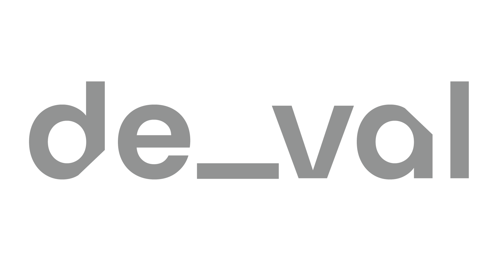

<div align="center">

# De-Val: The Ultimate Decentralized Evaluation Subnet for LLMs <!-- omit in toc -->
<a href="https://www.de-val.ai">
  
</a>

[](https://opensource.org/licenses/MIT)

</div>

---
- [Introduction](#introduction)
- [Key Features](#key-features)
- [Miner and Validator Functionality](#miner-and-validator-functionality)
  - [Bittensor Basics](#bittensor)
  - [Miner](#miner)
  - [Validator](#validator)
- [Roadmap](#roadmap)
- [Running Miners and Validators](#running-miners-and-validators)
  - [Bittensor Basics](#bittensor)
  - [Running a Miner](#running-a-miner)
  - [Running a Validator](#running-a-validator)
- [De-Val Community](#community)
- [License](#license)

---
### Introduction

Welcome to De-Val, the pioneering decentralized evaluation subnet for large language models (LLMs). Built on the robust Bittensor network, De-Val offers unmatched objectivity and reliability in evaluating LLM outputs, tackling challenges such as hallucinations, misattributions, relevancy and summary completeness.

Our unique approach leverages synthetic data for initial training with long-term plans to provide evaluation and monitoring capabilities for businesses looking to improve their own LLM based solutions through A/B testing or offline validation. Our primary focus is evaluation in the context of RAG based scenarios to help businesses answer questions such as:
- How accurate is my LLM given the provided context?
- How comprehensive are our abstractive summaries? Are we missing key details?
- Can we correctly identify key users and match their names to relevant action items? 

In our first iteration of the subnet, we will release evaluators focused on:
- Hallucination Detection: Identifying false or nonsensical outputs within LLM summaries given a RAG context.
- Misattribution Correction: Measuring participant attribution accuracy in LLM summaries from sales calls, meetings, general chat messages, etc.
- Summary Completeness: Evaluating the thoroughness and reliability of generated summaries.
- Relevancy: Binary prediction of whether a response is relevant to a user's query or not.

## Key Features
🔑 **Unbiased, Decentralized Evaluations**
- Leveraging the power of decentralization to ensure unbiased and reliable assessments.
- Community-driven evaluations for continuous improvement.

🔍 **Advanced Evaluation Metrics**
- Evaluators focused on detecting hallucinations, correcting misattributions, and assessing summary completeness.
- Continuous addition of new evaluators based on community feedback and evolving needs.

💼 **Cost-Effective Solutions for SMBs**
- Flexible pay-per-query API model or subscription, providing affordable access to advanced LLM evaluation tools.
- Tailored solutions for specific business needs.

📊 **Detailed Feedback and Analytics**
- Comprehensive scoring from 0 to 1, offering actionable insights for optimizing RAG pipelines.
- Intuitive dashboards for tracking and analyzing performance metrics.

🔄 **Seamless Integration and Scalability**
- Easy-to-use APIs for integration with existing systems.
- Scalable solutions designed to grow with your business needs.

## Miner and Validator Functionality

### Miner

- Receives evaluation queries from the Validator containing specific information such as context and LLM responses.
- Processes these queries using advanced machine learning models to assess factors like hallucination detection and relevancy.
- Submits detailed evaluation scores back to the Validator for further action and validation.

### Validator

- Collects evaluation results from Miners, including scores and detailed analysis.
- Compares these results against set benchmarks and real-world data, ensuring accuracy and reliability.
- Logs the validation results for auditing and continuous improvement of the evaluation system on the De-Val platform.

## Roadmap

Our key goals for this subnet are:
1. Immediately launch an external API to enable developers an researchers to leverage reference-free evaluations for their research and applications. 
1. Integrate evaluation methods into a synthetic data generation pipeline to ensure that we can generate high-quality and substantive synthetic data for training and benchmarking purposes. 
1. Deploy a new leaderboard based on synthetic data evaluated by models generated on the de_val subnet. Expand trust and transparency in AI benchmarks. 

### Phase 1: Foundation (Q3 2024)
- [x] Launch on testnet
- [x] Develop baseline evaluators
- [x] Launch on Testnet
- [x] Launch website
- [x] Begin marketing for brand awareness and interest
- [ ] Integrate contest style validation and winner takes most incentive
- [ ] Develop top-down task generation approach (currently only bottoms up generation)

### Phase 2: Expansion (Q4 2024)
- [ ] Launch outward-facing API
- [ ] Achieve competitive baseline evaluation accuracy
- [ ] Collaborations and partnerships with synergistic companies and subnets
- [ ] Introduce next level of evaluation metrics
- [ ] Monetize evaluations through API
- [ ] Develop tools to generate high-quality synthetic data based on our evaluators
- [ ] Launch the de_val leaderboard aimed at providing a constantly changing, reference-free synthetic data leaderboard that is harder to game, but also fully transparent

### Phase 3: Refinement (Q1 2025)
- [ ] Build an open-source database for real-world data submissions
- [ ] Market and sales expansion
- [ ] Expand to additional evaluation metrics such as harmful content detection
- [ ] Explore niche use cases such as regulatory evaluation and privacy compliance
- [ ] Monetize API access to evaluations and proprietary database

## Running Miners and Validators
### Requirements
- Python 3.10+
- Poetry
- CPU only instance
- OPENAI API key
- WANDB API key - Optional - Validators only

### Bittensor Setup

Follow the bittensor docs [here](https://docs.bittensor.com/getting-started/installation), or paste the following commands into the terminal.
```
sudo apt update && sudo apt install python3-pip

python3 -m pip install bittensor
```

In order to ease management of the scripts and miners running, we recommend using `PM2` as your process manager. In order to install `PM2`:
```
sudo apt update && sudo apt install jq && sudo apt install npm && sudo npm install pm2 -g && pm2 update
```
For guidance on how to set up your local subtensor click [here](https://docs.bittensor.com/subtensor-nodes/subtensor-node-requirements).

Setting up your wallet can be found [here](https://docs.bittensor.com/getting-started/wallets).

#### Installing poetry
```
curl -sSL https://install.python-poetry.org | python3 -
```

Once the above steps are completed log out of your instance and log back in to see `bittensor` and `poetry` installed.

### Validator Setup
We attempted to make everything as easy to run as possible, that is why we went with `poetry` as the package and venv manager.

To set up your validator you will need to follow these steps:
```
git clone https://github.com/deval-core/De-Val.git
cd De-Val

# Adding your OPENAI API and WANDB key to your .env file
echo -e "OPENAI_API_KEY=<your_openai_key_here>\nWANDB_API_KEY=<your_wandb_key_here>" > .env


# Install packages and dependencies using poetry.
poetry install
```
NOTE: While logging on WANDB is optional - we would highly encourage validators to do so.

Once that is done, you can activate your venv with `poetry shell`.

```
poetry shell
```
Now that everyhing ready you are ready to launch your validator after registering to the subnet.
example command for registering a validator/miner:
```
btcli s register --subtensor.network <local/test/finney> --netuid <15> --wallet.name YOUR_COLDKEY --wallet.hotkey YOUR_HOTKEY

```

Running Validator:
```
pm2 start neurons/validator.py --name de-val-validator -- \
    --netuid 15
    --subtensor.network <finney/local/test>
    --wallet.name <your coldkey> # Must be created using the bittensor-cli
    --wallet.hotkey <your hotkey> # Must be created using the bittensor-cli
    --logging.debug # Run in debug mode
    --logging.trace # For trace mode
    --axon.port # VERY IMPORTANT: set the port to be one of the open TCP ports on your machine
```

## New: Guide for Choosing Models for Validation

If you'd like to explicitly define which models to run for validation (e.g., OpenAI, Anthropic, Mistral), please refer to our [Validator Model Selection Guide](docs/Validator_AWS_README.md). This guide includes instructions on how to configure your validator to choose specific models using the `--neuron.model_ids` flag.

---
### Miner Setup

Just like the validator setup we attempted to make everything as easy to run as possible, that is why we went with `poetry` as the package and venv manager.

to set up your validator you will need to follow these steps:
```
git clone https://github.com/deval-core/De-Val.git
cd De-Val

# Adding your OPENAI API key to your .env file
echo "OPENAI_API_KEY=<your_key_here>" > .env

# Install packages and dependencies using poetry.
poetry install
```
Once that is done, you can activate your venv with `poetry shell`.

```
poetry shell
```
Now that everyhing ready you are ready to launch your validator after registering to the subnet.
example command for registering a validator/miner:
```
btcli s register --subtensor.network <local/test/finney> --netuid <15> --wallet.name YOUR_COLDKEY --wallet.hotkey YOUR_HOTKEY
```

Running Miner:
```
pm2 start neurons/miners/openai_miner.py --name de-val-miner -- \
    --netuid 15 
    --subtensor.network <finney/local/test>
    --wallet.name <your coldkey> # Must be created using the bittensor-cli
    --wallet.hotkey <your hotkey> # Must be created using the bittensor-cli
    --logging.debug # Run in debug mode
    --logging.trace # For trace mode
    --axon.port # VERY IMPORTANT: set the port to be one of the open TCP ports on your machine
```
Currently we are available on mainnet with NETUID: `15` and testnet with NETUID:`202`

## Community

[Discord](https://discord.com/channels/799672011265015819/1272557411948957697)

[WandB](https://wandb.ai/deval-ai/subnet/overview) 

[De-val official website](de-val.ai)


## License

De-Val subnet is released under the MIT License.

```
MIT License

Copyright (c) 2023 Opentensor

Permission is hereby granted, free of charge, to any person obtaining a copy
of this software and associated documentation files (the "Software"), to deal
in the Software without restriction, including without limitation the rights
to use, copy, modify, merge, publish, distribute, sublicense, and/or sell
copies of the Software, and to permit persons to whom the Software is
furnished to do so, subject to the following conditions:

The above copyright notice and this permission notice shall be included in all
copies or substantial portions of the Software.

THE SOFTWARE IS PROVIDED "AS IS", WITHOUT WARRANTY OF ANY KIND, EXPRESS OR
IMPLIED, INCLUDING BUT NOT LIMITED TO THE WARRANTIES OF MERCHANTABILITY,
FITNESS FOR A PARTICULAR PURPOSE AND NONINFRINGEMENT. IN NO EVENT SHALL THE
AUTHORS OR COPYRIGHT HOLDERS BE LIABLE FOR ANY CLAIM, DAMAGES OR OTHER
LIABILITY, WHETHER IN AN ACTION OF CONTRACT, TORT OR OTHERWISE, ARISING FROM,
OUT OF OR IN CONNECTION WITH THE SOFTWARE OR THE USE OR OTHER DEALINGS IN THE
SOFTWARE.
```
